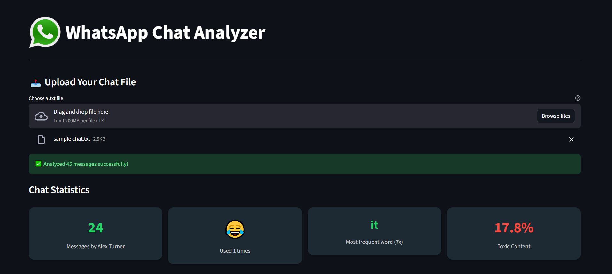
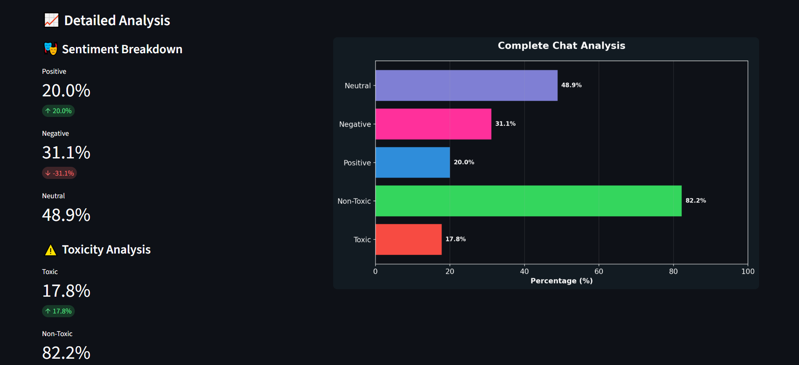

# WhatsApp Chat Analyzer

## **Overview**

WhatsApp Chat Analyzer is an AI-powered application developed in Python that analyzes exported WhatsApp chats and provides meaningful insights about conversations. The application supports direct messages (DMs), group chats, and communities exported as `.txt` files.

Using Machine Learning and Natural Language Processing (NLP), the application performs toxicity detection, sentiment analysis, and chat activity analysis through an interactive Streamlit interface.

---

## **Features**

* Most active user detection
* Most frequently used word analysis
* Most frequently used emoji analysis
* Toxicity percentage calculation
* Non-toxicity percentage calculation
* Sentiment analysis

  * Positive messages percentage
  * Negative messages percentage
  * Neutral messages percentage
* Graphical visualization of chat statistics
* Interactive web interface built with Streamlit

---

## **Technologies Used**

* Python
* Streamlit
* Scikit-learn
* NLTK
* Pandas
* Matplotlib
* Joblib
* Emoji

---

## **Project Structure**

```text
WhatsApp Chat Analyzer/
│
├── App.py
├── toxicity_model.py
├── whatsapp.png
│
├──  train.csv 
│
├── toxicity_model.pkl        (Generated after training)
├── toxicity_vectorizer.pkl   (Generated after training)
│
└── README.md
```

---

## **Setup Instructions**

### 1. Clone the Repository

```bash
git clone https://github.com/your-username/whatsapp-chat-analyzer.git
cd whatsapp-chat-analyzer
```

### 2. Install Required Libraries

```bash
pip install pandas nltk joblib scikit-learn matplotlib emoji streamlit
```


### 3. Dataset Setup and File Paths

This project uses the **Jigsaw Toxic Comment Classification Challenge dataset** from Kaggle:

https://www.kaggle.com/datasets/julian3833/jigsaw-toxic-comment-classification-challenge

The dataset contains multiple files, but **only `train.csv` is used** for training the model.

After downloading the dataset:

1. Extract the files
2. Place only `train.csv` into the project folder under:

csv files/train.csv

OR update the path inside `toxicity_model.py` accordingly.

---

Before running the project, also ensure that file paths in `toxicity_model.py` match your local system setup.

If needed, replace absolute paths like:

C:/Users/SystemUsername/Desktop/WhatsApp Chat Analyzer/

with your actual project directory path.

---

## **Training the Toxicity Model**

Run the following command:

```bash
python toxicity_model.py
```

This will generate:

* `toxicity_model.pkl`
* `toxicity_vectorizer.pkl`

These files are required for the application to function correctly.

---

## **Running the Application**

Start the Streamlit application using:

```bash
streamlit run App.py
```

After the application launches in your browser:

1. Export a WhatsApp chat as a `.txt` file.
2. Upload the exported chat.
3. View the generated analysis and visualizations.

---

## Screenshots




---

## **Supported Language**

Currently, the application supports **English-language chats only**.

Chats containing mostly non-English text may not produce accurate results because the toxicity and sentiment analysis models are designed for English text.

---

## **Future Enhancements**

* Multi-language support
* Word cloud generation
* Additional chat statistics
* Improved toxicity classification
* Advanced visual analytics

---

## **License**

This project is licensed under the MIT License.
